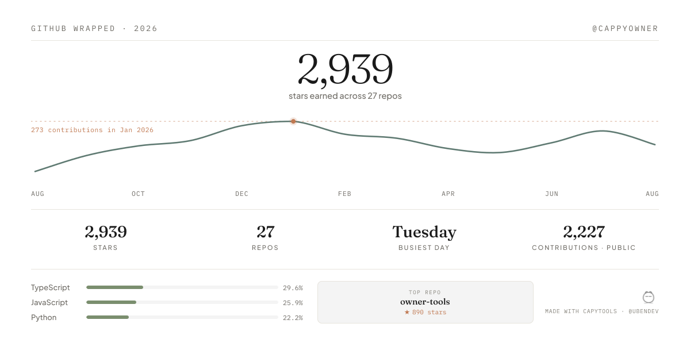
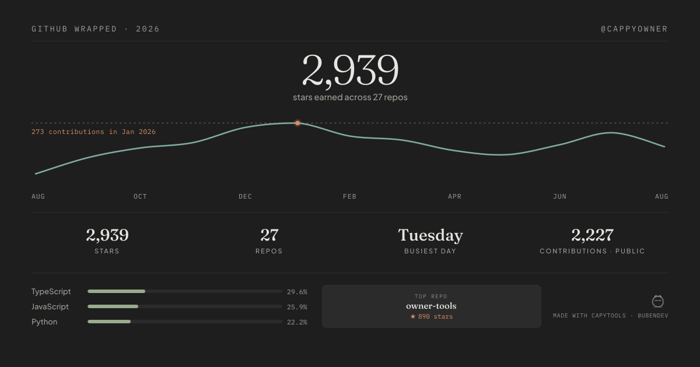

# Capytools

A home for small, quiet tools. One so far.

## Cappy Wrapped

Your GitHub year, wrapped in a calm little card. Named after the capybara.

**[capytools.vercel.app](https://capytools.vercel.app)**

Paste a GitHub username and you get a card showing:

- **Total public contributions** for the year
- **A trendline** of the year, month by month, with your busiest month marked
- **Stars** earned across your repositories
- **Your top languages**, and your most-starred repo

Download it as a PNG, or post it straight to X. Wide and square formats, light
and dark. No signup, no tracking, nothing stored.

Only *public* contributions are visible to an anonymous visitor, so the number
is lower than the one on your own profile page, which counts private work too.

## License

[MIT](LICENSE).
