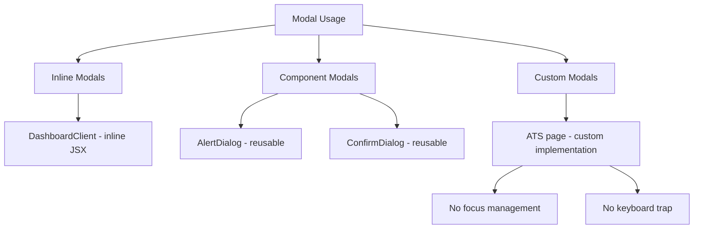
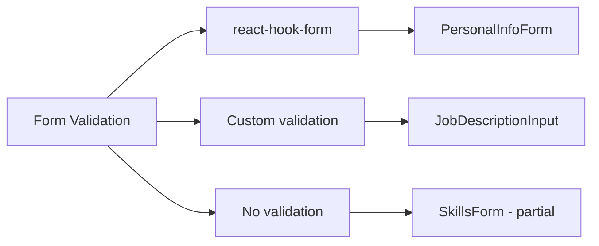
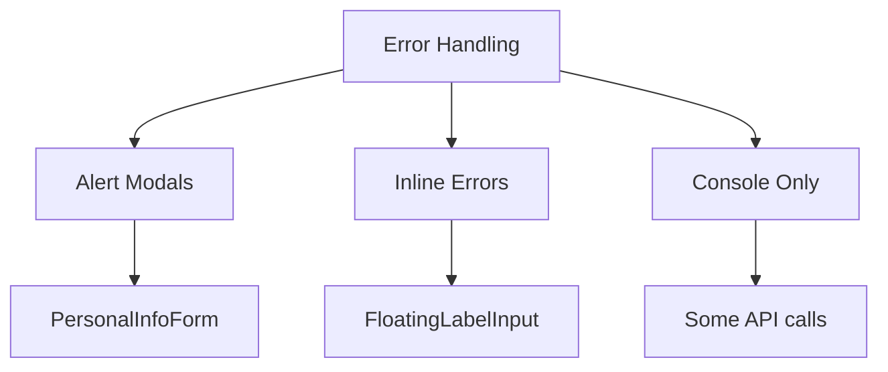
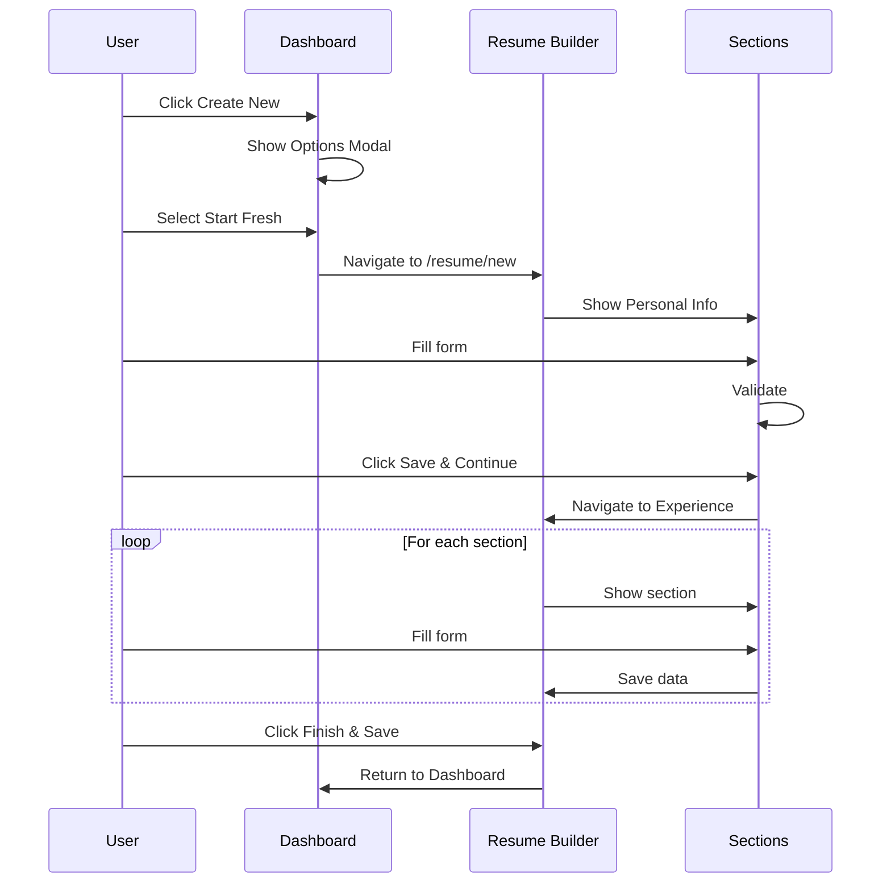
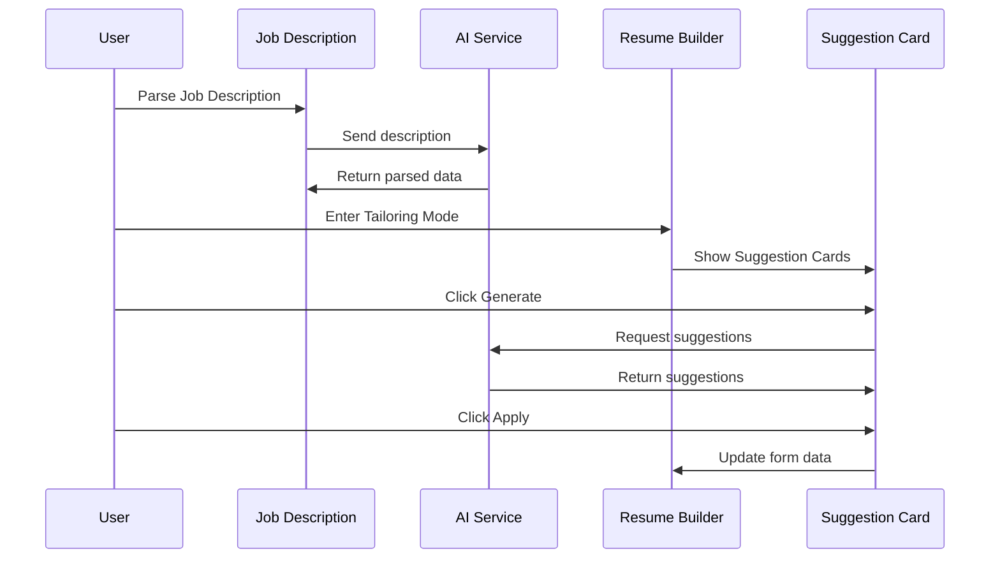
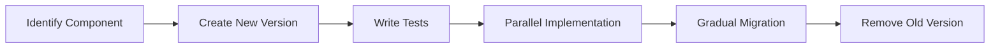

# UI/UX Refactoring Roadmap
## Handcraft Resume - Design Consistency & Technical Maintainability

> **Document Version:** 1.0  
> **Created:** 2026-01-23  
> **Status:** Draft for Review

---

## Executive Summary

This roadmap outlines a comprehensive refactoring strategy for the Handcraft Resume application, focusing on establishing strict design consistency, modular scalability, and technical maintainability. The plan preserves the existing visual identity, color palette (Deep Indigo brand colors), and Swiss Modern aesthetic while optimizing user flows, interaction patterns, and accessibility (WCAG) standards.

### Key Objectives
- **Design Consistency:** Establish a unified design system with clear patterns
- **Modular Scalability:** Create reusable, composable components
- **Technical Maintainability:** Improve code quality and developer experience
- **Accessibility Excellence:** Achieve WCAG 2.1 AA compliance
- **User Experience:** Optimize flows and interaction patterns

---

## 1. Current State Audit

### 1.1 Design Token Analysis

| Category | Current State | Issues Identified |
|----------|---------------|-------------------|
| **Colors** | HSL-based CSS variables with brand scale (50-900) | ✅ Well-defined; semantic colors present |
| **Typography** | Inter (body), Plus Jakarta Sans (display) | ✅ Good foundation; inconsistent usage |
| **Spacing** | Tailwind arbitrary values used | ⚠️ Inconsistent; no standard scale |
| **Border Radius** | Custom values (0.5rem, xl, 2xl, 2.5rem) | ⚠️ Mixed usage across components |
| **Shadows** | Custom shadow-swiss, shadow-swiss-hover | ✅ Good foundation; underutilized |
| **Animations** | Defined keyframes (fadeIn, slideUp, scaleIn, shimmer) | ✅ Good foundation; inconsistent application |

### 1.2 Component Inventory

#### Core UI Components (Status Assessment)

| Component | Status | Issues |
|-----------|--------|--------|
| [`Button`](components/ui/button.tsx) | ✅ Good | 11 variants; some redundancy (default/brand similar) |
| [`Input`](components/ui/input.tsx) | ✅ Good | Supports icons, error states |
| [`Card`](components/ui/card.tsx) | ✅ Good | Multiple variants; consistent |
| [`Badge`](components/ui/badge.tsx) | ✅ Good | Good variant system |
| [`Label`](components/ui/label.tsx) | ⚠️ Basic | Minimal functionality |
| [`Textarea`](components/ui/textarea.tsx) | ✅ Good | Consistent with Input |
| [`AlertDialog`](components/ui/AlertDialog.tsx) | ⚠️ Basic | No keyboard trap, focus management |
| [`ConfirmDialog`](components/ui/ConfirmDialog.tsx) | ⚠️ Basic | Same issues as AlertDialog |
| [`FloatingLabelInput`](components/ui/floating-label-input.tsx) | ✅ Good | Good UX pattern |
| [`SuggestionCard`](components/resume/SuggestionCard.tsx) | ✅ Good | Well-designed AI interaction |

#### Page-Level Components

| Component | Lines | Issues |
|-----------|-------|--------|
| [`DashboardClient`](components/dashboard/DashboardClient.tsx) | 730 | ⚠️ Too large; multiple concerns |
| [`ResumeBuilder`](components/resume/ResumeBuilder.tsx) | 440 | ⚠️ Large; mixed responsibilities |
| [`ATSScorePage`](app/ai/ats-score/page.tsx) | 552 | ⚠️ Large; complex state |
| [`PersonalInfoForm`](components/resume/PersonalInfoForm.tsx) | 310 | ✅ Reasonable size |
| [`SkillsForm`](components/resume/SkillsForm.tsx) | 327 | ✅ Reasonable size |

### 1.3 Pattern Inconsistencies Identified

#### Modal Patterns


**Issue:** Three different modal patterns with inconsistent behavior and accessibility.

#### Form Validation Patterns


**Issue:** Inconsistent validation approaches across forms.

#### Error Handling Patterns


**Issue:** No unified error handling strategy.

### 1.4 Accessibility Audit (WCAG 2.1 AA)

| Criterion | Status | Gaps |
|-----------|--------|------|
| **Color Contrast** | ⚠️ Partial | Need verification on all text/background combos |
| **Focus Indicators** | ⚠️ Partial | Inconsistent focus states across components |
| **Keyboard Navigation** | ❌ Poor | Modal focus management missing |
| **ARIA Labels** | ❌ Poor | Missing on many interactive elements |
| **Screen Reader Support** | ❌ Poor | No live regions for dynamic content |
| **Form Labels** | ✅ Good | Labels present but inconsistent association |
| **Error Identification** | ⚠️ Partial | Not all errors programmatically associated |

### 1.5 User Flow Analysis

#### Resume Creation Flow


**Issues Identified:**
- No progress indicator showing completion percentage
- No ability to skip sections
- No preview during editing
- Back navigation inconsistent

#### AI Tailoring Flow


**Issues Identified:**
- No clear indication of tailoring mode status
- Suggestion cards can be dismissed accidentally
- No way to compare original vs suggested content

---

## 2. Design System Implementation Strategy

### 2.1 Design Token Standardization

#### Spacing Scale
Create a consistent spacing scale to replace arbitrary values:

```css
/* Design Tokens - Spacing */
--space-1: 0.25rem;   /* 4px */
--space-2: 0.5rem;    /* 8px */
--space-3: 0.75rem;   /* 12px */
--space-4: 1rem;      /* 16px */
--space-5: 1.25rem;   /* 20px */
--space-6: 1.5rem;    /* 24px */
--space-8: 2rem;      /* 32px */
--space-10: 2.5rem;   /* 40px */
--space-12: 3rem;     /* 48px */
--space-16: 4rem;     /* 64px */
--space-20: 5rem;     /* 80px */
--space-24: 6rem;     /* 96px */
```

#### Border Radius Standardization
```css
/* Design Tokens - Border Radius */
--radius-sm: 0.375rem;   /* 6px */
--radius-md: 0.5rem;     /* 8px */
--radius-lg: 0.75rem;    /* 12px */
--radius-xl: 1rem;       /* 16px */
--radius-2xl: 1.5rem;   /* 24px */
--radius-3xl: 2rem;      /* 32px */
--radius-full: 9999px;
```

#### Animation Durations
```css
/* Design Tokens - Animation */
--duration-fast: 150ms;
--duration-normal: 250ms;
--duration-slow: 400ms;
--duration-slower: 600ms;
```

### 2.2 Component Architecture

#### Component Hierarchy
```
components/
├── ui/                          # Primitive components (atomic)
│   ├── primitives/              # Radix UI primitives
│   ├── base/                    # Base styled components
│   └── composite/               # Composite components
├── forms/                       # Form-related components
│   ├── fields/                  # Individual form fields
│   ├── groups/                  # Form groups/sections
│   └── validation/             # Validation utilities
├── feedback/                    # Feedback components
│   ├── toasts/                  # Toast notifications
│   ├── alerts/                  # Alert banners
│   └── progress/               # Progress indicators
├── layout/                      # Layout components
│   ├── containers/              # Container components
│   ├── grids/                   # Grid layouts
│   └── sections/                # Section components
└── patterns/                    # Reusable patterns
    ├── modals/                  # Modal patterns
    ├── cards/                   # Card patterns
    └── lists/                   # List patterns
```

### 2.3 Component Composition Guidelines

#### Compound Component Pattern
For complex components like Cards, Modals, and Forms:

```tsx
// Example: Compound Card Component
<Card>
  <CardHeader>
    <CardTitle>Title</CardTitle>
    <CardDescription>Description</CardDescription>
  </CardHeader>
  <CardContent>Content</CardContent>
  <CardFooter>
    <Button>Action</Button>
  </CardFooter>
</Card>
```

#### Render Props Pattern
For flexible component behavior:

```tsx
// Example: Flexible List Component
<EditableList
  items={skills}
  renderItem={(item, index) => (
    <SkillItem key={index} skill={item} />
  )}
  renderEmpty={() => <EmptyState message="No skills yet" />}
/>
```

### 2.4 Theme System Enhancement

#### Theme Contract
Define a strict theme contract for all components:

```typescript
// Theme Contract
interface ThemeContract {
  colors: {
    primary: ColorScale;
    secondary: ColorScale;
    accent: ColorScale;
    neutral: ColorScale;
    semantic: {
      success: ColorScale;
      warning: ColorScale;
      error: ColorScale;
      info: ColorScale;
    };
  };
  typography: {
    scale: TypographyScale;
    weights: FontWeightScale;
    lineHeights: LineHeightScale;
  };
  spacing: SpacingScale;
  radius: RadiusScale;
  shadows: ShadowScale;
  animation: AnimationScale;
}
```

---

## 3. Prioritized Functional Improvements

### Phase 1: Foundation (Weeks 1-2)
**Priority: Critical**

#### 1.1 Design Token Standardization
- [ ] Create design token file with spacing, radius, duration scales
- [ ] Update Tailwind config to use design tokens
- [ ] Audit and update all components to use standardized tokens
- [ ] Document token usage guidelines

**Impact:** Establishes consistency foundation

#### 1.2 Unified Modal System
- [ ] Create base [`Modal`](components/ui/modal/Modal.tsx) component with:
  - Focus trap implementation
  - Keyboard navigation (Esc to close)
  - ARIA attributes
  - Backdrop blur support
- [ ] Create [`ModalHeader`](components/ui/modal/ModalHeader.tsx), [`ModalBody`](components/ui/modal/ModalBody.tsx), [`ModalFooter`](components/ui/modal/ModalFooter.tsx) subcomponents
- [ ] Migrate all inline modals to unified system
- [ ] Update [`AlertDialog`](components/ui/AlertDialog.tsx) and [`ConfirmDialog`](components/ui/ConfirmDialog.tsx) to use base Modal

**Impact:** Consistent UX, improved accessibility

#### 1.3 Form Validation Standardization
- [ ] Create [`Form`](components/forms/Form.tsx) wrapper component
- [ ] Create [`FormField`](components/forms/FormField.tsx) component with:
  - Label association
  - Error display
  - Helper text
  - Required indicator
- [ ] Standardize validation error display pattern
- [ ] Migrate all forms to use standardized components

**Impact:** Consistent form UX, reduced code duplication

### Phase 2: Accessibility Enhancement (Weeks 3-4)
**Priority: High**

#### 2.1 Focus Management
- [ ] Implement focus restoration after modal close
- [ ] Add visible focus indicators to all interactive elements
- [ ] Implement skip links for keyboard users
- [ ] Add focus trap to all modals and dropdowns

#### 2.2 ARIA Attributes
- [ ] Audit all interactive elements for missing ARIA labels
- [ ] Add `aria-live` regions for dynamic content updates
- [ ] Implement `aria-expanded` for collapsible elements
- [ ] Add `aria-describedby` for form field help text

#### 2.3 Screen Reader Support
- [ ] Add screen reader-only text for icon-only buttons
- [ ] Implement proper heading hierarchy
- [ ] Add landmarks (`main`, `nav`, `aside`) to page structure
- [ ] Test with screen readers (NVDA, VoiceOver)

#### 2.4 Color Contrast Verification
- [ ] Audit all color combinations for WCAG AA compliance
- [ ] Create contrast checker utility
- [ ] Document approved color combinations
- [ ] Fix any contrast issues

### Phase 3: Component Refactoring (Weeks 5-7)
**Priority: High**

#### 3.1 Large Component Decomposition
- [ ] Decompose [`DashboardClient`](components/dashboard/DashboardClient.tsx) into:
  - [`DashboardHeader`](components/dashboard/DashboardHeader.tsx)
  - [`DashboardStats`](components/dashboard/DashboardStats.tsx)
  - [`ResumeGrid`](components/dashboard/ResumeGrid.tsx)
  - [`AIToolbox`](components/dashboard/AIToolbox.tsx)
  - [`RecentUploads`](components/dashboard/RecentUploads.tsx)
- [ ] Decompose [`ResumeBuilder`](components/resume/ResumeBuilder.tsx) into:
  - [`BuilderHeader`](components/resume/BuilderHeader.tsx)
  - [`BuilderLayout`](components/resume/BuilderLayout.tsx)
  - [`SectionProgress`](components/resume/SectionProgress.tsx)

#### 3.2 Button Variant Consolidation
- [ ] Audit button variants for redundancy
- [ ] Consolidate `default` and `brand` variants
- [ ] Document clear use cases for each variant
- [ ] Update all button usages to follow guidelines

#### 3.3 Card Pattern Standardization
- [ ] Create card variant guidelines
- [ ] Standardize card padding and spacing
- [ ] Create card composition patterns
- [ ] Update all card usages

#### 3.4 Loading State System
- [ ] Create [`LoadingOverlay`](components/ui/loading/LoadingOverlay.tsx) component
- [ ] Create [`Skeleton`](components/ui/loading/Skeleton.tsx) component with variants
- [ ] Standardize loading patterns across the app
- [ ] Add loading states to all async operations

### Phase 4: User Flow Optimization (Weeks 8-9)
**Priority: Medium**

#### 4.1 Resume Creation Flow
- [ ] Add progress indicator showing completion percentage
- [ ] Implement section skip functionality
- [ ] Add inline preview during editing
- [ ] Improve back navigation consistency
- [ ] Add keyboard shortcuts (Ctrl+S to save, etc.)

#### 4.2 AI Interaction Flow
- [ ] Add clear tailoring mode indicator
- [ ] Implement suggestion comparison view
- [ ] Add suggestion history
- [ ] Improve loading states for AI operations
- [ ] Add error recovery for AI failures

#### 4.3 Dashboard Navigation
- [ ] Improve breadcrumb navigation
- [ ] Add quick actions menu
- [ ] Implement keyboard navigation shortcuts
- [ ] Add search functionality for resumes

#### 4.4 Error Handling Flow
- [ ] Create unified error boundary component
- [ ] Implement retry mechanisms for failed operations
- [ ] Add user-friendly error messages
- [ ] Create error reporting flow

### Phase 5: Polish & Documentation (Weeks 10-11)
**Priority: Medium**

#### 5.1 Animation Consistency
- [ ] Standardize animation durations across components
- [ ] Implement consistent easing functions
- [ ] Add reduced motion support
- [ ] Document animation guidelines

#### 5.2 Responsive Design
- [ ] Audit all breakpoints
- [ ] Improve mobile layouts
- [ ] Test on various screen sizes
- [ ] Document responsive patterns

#### 5.3 Documentation
- [ ] Create component storybook (optional)
- [ ] Document all components with usage examples
- [ ] Create design system documentation
- [ ] Document accessibility guidelines

#### 5.4 Performance
- [ ] Implement code splitting for large components
- [ ] Optimize images and assets
- [ ] Add lazy loading for off-screen content
- [ ] Implement virtual scrolling for long lists

### Phase 6: Advanced Features (Weeks 12+)
**Priority: Low**

#### 6.1 Advanced Patterns
- [ ] Implement drag-and-drop for list reordering
- [ ] Add undo/redo functionality
- [ ] Implement auto-save with conflict resolution
- [ ] Add collaborative features

#### 6.2 Analytics & Monitoring
- [ ] Add user behavior tracking
- [ ] Implement error monitoring
- [ ] Add performance monitoring
- [ ] Create analytics dashboard

---

## 4. Technical Implementation Details

### 4.1 New Component Specifications

#### Unified Modal Component
```typescript
// components/ui/modal/Modal.tsx
interface ModalProps {
  isOpen: boolean;
  onClose: () => void;
  size?: 'sm' | 'md' | 'lg' | 'xl' | 'full';
  variant?: 'default' | 'centered' | 'fullscreen';
  closeOnBackdropClick?: boolean;
  closeOnEscape?: boolean;
  showCloseButton?: boolean;
  children: React.ReactNode;
}

// Usage
<Modal isOpen={showModal} onClose={() => setShowModal(false)} size="md">
  <ModalHeader>
    <ModalTitle>Confirm Action</ModalTitle>
    <ModalDescription>Are you sure you want to proceed?</ModalDescription>
  </ModalHeader>
  <ModalBody>
    {/* Content */}
  </ModalBody>
  <ModalFooter>
    <Button variant="outline" onClick={handleCancel}>Cancel</Button>
    <Button onClick={handleConfirm}>Confirm</Button>
  </ModalFooter>
</Modal>
```

#### Form Field Component
```typescript
// components/forms/FormField.tsx
interface FormFieldProps {
  label: string;
  error?: string;
  helperText?: string;
  required?: boolean;
  children: React.ReactNode;
}

// Usage
<FormField label="Email" error={errors.email} required helperText="We'll never share your email">
  <Input type="email" {...register('email')} />
</FormField>
```

#### Progress Indicator Component
```typescript
// components/feedback/ProgressIndicator.tsx
interface ProgressIndicatorProps {
  steps: Array<{ id: string; label: string }>;
  currentStep: string;
  completedSteps: string[];
}

// Usage
<ProgressIndicator
  steps={[
    { id: 'personal', label: 'Personal Info' },
    { id: 'experience', label: 'Experience' },
    { id: 'education', label: 'Education' },
  ]}
  currentStep="experience"
  completedSteps={['personal']}
/>
```

### 4.2 Accessibility Implementation Checklist

#### Modal Accessibility
```typescript
// Required ARIA attributes for modals
- role="dialog" or role="alertdialog"
- aria-modal="true"
- aria-labelledby="[title-id]"
- aria-describedby="[description-id]" (optional)
- Focus trap implementation
- Focus restoration on close
- Escape key handler
```

#### Form Accessibility
```typescript
// Required attributes for form fields
- id="[unique-id]"
- htmlFor="[unique-id]" on label
- aria-invalid="true" for invalid fields
- aria-describedby="[error-id]" for error messages
- aria-required="true" for required fields
```

#### Button Accessibility
```typescript
// Required attributes for buttons
- aria-label="[descriptive-text]" for icon-only buttons
- aria-expanded="[true|false]" for toggle buttons
- aria-pressed="[true|false]" for toggle buttons
```

### 4.3 State Management Patterns

#### Form State Pattern
```typescript
// Use a consistent form state pattern
interface FormState<T> {
  data: T;
  errors: Record<keyof T, string>;
  touched: Record<keyof T, boolean>;
  isDirty: boolean;
  isValid: boolean;
  isSubmitting: boolean;
}
```

#### Loading State Pattern
```typescript
// Use a consistent loading state pattern
interface LoadingState {
  isLoading: boolean;
  error: Error | null;
  data: unknown | null;
}

// Usage
const { isLoading, error, data } = useAsyncOperation(
  async () => await fetchResume(id)
);
```

---

## 5. Migration Strategy

### 5.1 Component Migration Approach



### 5.2 Backward Compatibility

- Keep old components during migration period
- Use feature flags for new implementations
- Provide migration path for existing code
- Document deprecation timeline

### 5.3 Testing Strategy

#### Unit Tests
- Test all new components in isolation
- Test component composition
- Test accessibility attributes

#### Integration Tests
- Test user flows end-to-end
- Test state management
- Test error handling

#### Visual Regression Tests
- Capture screenshots of all pages
- Compare before/after refactoring
- Test responsive layouts

#### Accessibility Tests
- Automated testing with axe-core
- Manual testing with screen readers
- Keyboard navigation testing

---

## 6. Success Metrics

### 6.1 Design Consistency Metrics
- [ ] 100% of components use design tokens
- [ ] 0% arbitrary values in production code
- [ ] Consistent spacing across all pages
- [ ] Consistent typography hierarchy

### 6.2 Accessibility Metrics
- [ ] WCAG 2.1 AA compliance score: 100%
- [ ] axe-core automated tests: 0 critical issues
- [ ] Keyboard navigation: 100% functionality
- [ ] Screen reader compatibility: All major readers

### 6.3 Code Quality Metrics
- [ ] Component complexity: Average < 200 lines
- [ ] Code duplication: < 5%
- [ ] Test coverage: > 80%
- [ ] Lighthouse score: > 90

### 6.4 User Experience Metrics
- [ ] Task completion time: < 30% improvement
- [ ] Error rate: < 50% reduction
- [ ] User satisfaction: > 4.5/5
- [ ] Support tickets: < 30% reduction

---

## 7. Risk Assessment & Mitigation

| Risk | Probability | Impact | Mitigation |
|------|-------------|--------|------------|
| Breaking existing functionality | Medium | High | Comprehensive testing, gradual rollout |
| Performance degradation | Low | Medium | Performance monitoring, optimization |
| User resistance to changes | Medium | Medium | User testing, gradual rollout |
| Timeline overruns | Medium | Medium | Prioritize critical features, phased approach |
| Accessibility regressions | Low | High | Accessibility testing at each phase |

---

## 8. Resource Requirements

### 8.1 Development Resources
- Senior Frontend Developer: 12 weeks
- UI/UX Designer: 4 weeks (phased)
- QA Engineer: 8 weeks (phased)
- Accessibility Specialist: 2 weeks

### 8.2 Tools & Dependencies
- **Testing:** Jest, React Testing Library, Playwright
- **Accessibility:** axe-core, WAVE, NVDA, VoiceOver
- **Documentation:** Storybook (optional), MDX
- **Performance:** Lighthouse, WebPageTest

---

## 9. Appendices

### Appendix A: Component Audit Summary

| Component | Lines | Complexity | Accessibility | Priority |
|-----------|-------|------------|--------------|----------|
| Button | 65 | Low | Medium | Low |
| Input | 43 | Low | Medium | Low |
| Card | 91 | Low | High | Low |
| Badge | 51 | Low | High | Low |
| AlertDialog | 68 | Medium | Low | High |
| ConfirmDialog | 54 | Medium | Low | High |
| DashboardClient | 730 | High | Medium | High |
| ResumeBuilder | 440 | High | Medium | High |
| ATSScorePage | 552 | High | Low | Medium |

### Appendix B: Design Token Reference

#### Color Palette (Preserved)
```css
/* Primary - Deep Indigo */
--primary: 221 83% 53%; /* #4F46E5 */

/* Brand Scale */
--brand-50: 221 83% 97%;
--brand-100: 221 83% 93%;
--brand-200: 221 83% 85%;
--brand-300: 221 83% 75%;
--brand-400: 221 83% 65%;
--brand-500: 221 83% 53%;
--brand-600: 221 83% 45%;
--brand-700: 221 83% 35%;
--brand-800: 221 83% 25%;
--brand-900: 221 83% 15%;
```

#### Typography Scale
```css
/* Font Families */
--font-sans: 'Inter', system-ui, sans-serif;
--font-display: 'Plus Jakarta Sans', system-ui, sans-serif;

/* Font Sizes */
--text-xs: 0.75rem;    /* 12px */
--text-sm: 0.875rem;   /* 14px */
--text-base: 1rem;      /* 16px */
--text-lg: 1.125rem;    /* 18px */
--text-xl: 1.25rem;     /* 20px */
--text-2xl: 1.5rem;    /* 24px */
--text-3xl: 1.875rem;  /* 30px */
--text-4xl: 2.25rem;   /* 36px */
```

### Appendix C: WCAG 2.1 AA Checklist

| Criterion | Status | Notes |
|-----------|--------|-------|
| 1.1.1 Non-text Content | ⚠️ Partial | Icons need aria-labels |
| 1.3.1 Info and Relationships | ⚠️ Partial | Some headings need review |
| 1.3.2 Meaningful Sequence | ✅ Pass | DOM order logical |
| 1.3.3 Sensory Characteristics | ✅ Pass | No color-only indicators |
| 1.4.1 Use of Color | ✅ Pass | Not color-only |
| 1.4.3 Contrast (Minimum) | ⚠️ Partial | Need verification |
| 1.4.4 Resize Text | ✅ Pass | Zoom to 200% works |
| 1.4.10 Reflow | ✅ Pass | Responsive design |
| 1.4.11 Non-text Contrast | ⚠️ Partial | Need verification |
| 1.4.12 Text Spacing | ✅ Pass | Adjustable |
| 1.4.13 Content on Hover/Focus | ⚠️ Partial | Modals need focus trap |
| 2.1.1 Keyboard | ⚠️ Partial | Some elements not reachable |
| 2.1.2 No Keyboard Trap | ❌ Fail | Modals need fix |
| 2.1.4 Character Key Shortcuts | N/A | None implemented |
| 2.4.1 Bypass Blocks | ⚠️ Partial | Need skip links |
| 2.4.2 Page Titled | ✅ Pass | All pages have titles |
| 2.4.3 Focus Order | ⚠️ Partial | Some issues in modals |
| 2.4.4 Link Purpose | ⚠️ Partial | Some links need context |
| 2.5.1 Pointer Gestures | ✅ Pass | No complex gestures |
| 2.5.2 Pointer Cancellation | ✅ Pass | No issues |
| 2.5.3 Label in Name | ⚠️ Partial | Some buttons need review |
| 2.5.4 Motion Actuation | ✅ Pass | No motion activation |
| 2.5.5 Target Size | ⚠️ Partial | Some small targets |
| 3.2.1 On Focus | ✅ Pass | No unexpected changes |
| 3.2.2 On Input | ✅ Pass | No unexpected changes |
| 3.3.1 Error Identification | ⚠️ Partial | Inconsistent |
| 3.3.2 Labels or Instructions | ⚠️ Partial | Some missing |
| 3.3.3 Error Suggestion | ❌ Fail | No suggestions |
| 3.3.4 Error Prevention | ⚠️ Partial | Some confirmations |
| 4.1.1 Parsing | ✅ Pass | Valid HTML |
| 4.1.2 Name, Role, Value | ⚠️ Partial | Some ARIA missing |
| 4.1.3 Status Messages | ❌ Fail | No live regions |

---

## Conclusion

This refactoring roadmap provides a comprehensive approach to establishing design consistency, modular scalability, and technical maintainability for the Handcraft Resume application. The phased approach allows for incremental improvements while minimizing risk to existing functionality.

The key focus areas are:
1. **Design System Foundation** - Standardized tokens and components
2. **Accessibility Excellence** - WCAG 2.1 AA compliance
3. **Component Architecture** - Modular, reusable components
4. **User Experience** - Optimized flows and interactions

By following this roadmap, the application will achieve a consistent, accessible, and maintainable codebase that preserves the existing visual identity while providing an improved user experience.
